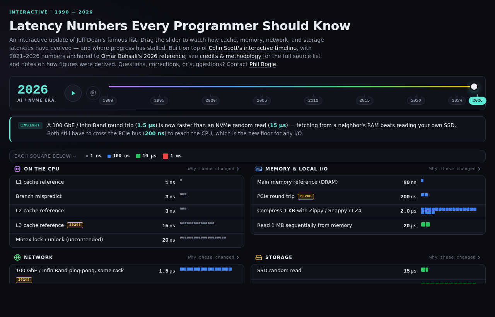

# Latency Numbers Every Programmer Should Know

An interactive, drag-to-scrub timeline of Jeff Dean's famous latency numbers, extended from 1990 through 2026.

**[Open the live page →](https://philbogle.github.io/interactive-latency-numbers/)**



## What this is

Jeff Dean's [original list](http://norvig.com/21-days.html#answers) (2002) and the canonical [interactive version by Colin Scott](https://colin-scott.github.io/personal_website/research/interactive_latency.html) (extended via Moore's-law-style formulas through ~2020) are the starting point. This page extends the timeline through 2026 and replaces the formulas for bandwidth-bound metrics — where pure exponential extrapolation produces increasingly fictional numbers — with year-anchored real-world measurements from hardware datasheets, peer-reviewed benchmarks, and published 2025–2026 references.

Specifically:

- **Storage, memory bandwidth, and seek times** use piecewise-linear interpolation between empirical measurements (e.g., Samsung 850 Evo for 2015 SSDs, NVMe Gen4 for 2022, NVMe Gen5 for 2026) rather than formulas.
- **Mutex latency, WAN round trips, and same-datacenter TCP RTT** use empirical anchors that reflect real-world kernel/scheduler/protocol overhead, not theoretical floors.
- **New modern metrics**: PCIe round trip, RDMA over 100 GbE / InfiniBand, and a selectable WAN destination across eight cities on five continents.
- **Era-aware narrative**: a one-sentence "insight" updates as you scrub, so each decade tells you which floor was actually binding (CPU, memory wall, network, flash, PCIe).

See the in-page **Credits & Methodology** section (linked from the intro paragraph) for the full source list and per-metric derivation notes.

## Running locally

It's a single self-contained HTML file — no build, no dependencies, no network calls:

```sh
git clone https://github.com/philbogle/interactive-latency-numbers.git
cd interactive-latency-numbers
open index.html   # or just double-click it
```

The page works offline once loaded.

## Deep-linking to a year

Append `#year=YYYY` to the URL to land on a specific year:

- <https://philbogle.github.io/interactive-latency-numbers/#year=1995>
- <https://philbogle.github.io/interactive-latency-numbers/#year=2010>
- <https://philbogle.github.io/interactive-latency-numbers/#year=2026>

## Credits

- [Jeff Dean & Peter Norvig](http://norvig.com/21-days.html#answers) — the original list
- [Colin Scott](https://colin-scott.github.io/personal_website/research/interactive_latency.html) — the interactive timeline this descends from
- [Omar Bohsali](https://omarish.com/latency-numbers-you-should-know) — 2026 reference anchors
- Hardware-specific sources listed in the in-page credits section

## Feedback

Questions, corrections, suggestions, or a metric you'd like added? Open an issue or email [philbogle@gmail.com](mailto:philbogle@gmail.com).
